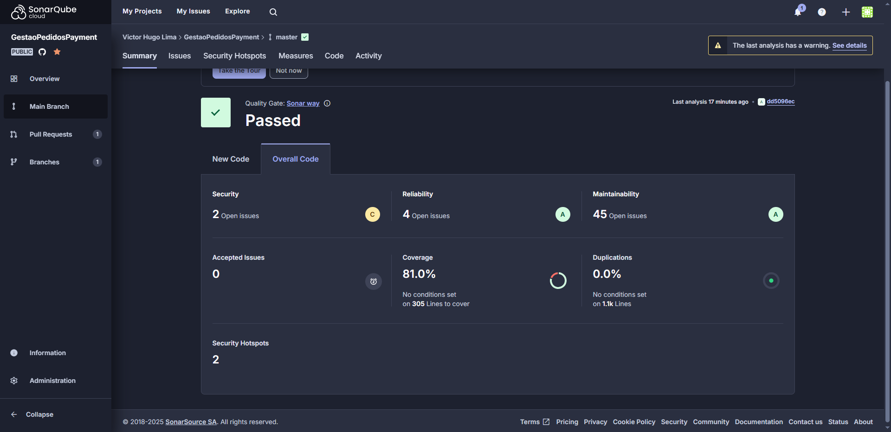

# order_api

API Rest para o microsserviço de gestão de pedidos


## 📝 Índice

- [Sobre](#about)
- [Testes](#documentation)
- [Comece por aqui](#getting_started)
- [Desenvolvedores](#authors)

## 🧐 Sobre <a name = "about"></a>

O projeto foi desenvolvido na linguagem .NET Core. O projeto consiste em um microserviço para realizar os pagamentos usando o mercado pago. A API de Order envia a request para esta API, que por sua vez faz a requisição para o mercado pago. Uma vez pago, esta API faz uma request http para o webhook de Order API notificando do pagamento.

### Microsserviço <a name = "about"></a>

Este microsserviço contempla a parte do gerenciamento do pagamento.

### Testes <a name = "documentation"></a>

Este microsserviço contém testes Unitários e Testes BDD.

Validação da build da aplicação e a qualidade do cógico com Sonarqube.

[]

## 🏁 Comece por aqui <a name = "getting_started"></a>

Comandos para rodar a API na máquina local para fins de desenvolvimento e teste.

### Kubernets
Para rodar o projeto usando o kubernet, é necessário seguir as etapas abaixo.

1. Instalar minikube.

2. No powershell, como administrador, execute o seguinte comando:
```
$ minikube start --driver=hyperv
```
3. Entrar na pasta k8s do projeto.
4. Execute no powershell, como administrador, os seguintes comandos:

```
$ & minikube -p minikube docker-env | Invoke-Expression
$ docker build -t gestaopedidospayment:latest .
$ kubectl apply -f app-deployment.yaml
$ kubectl apply -f app-service.yaml
$ kubectl get pods - ambos tem que estar Running e ready 1/1
```

## ✍️ Desenvolvedores <a name = "authors"></a>

- Handryo Casali
- Nicole Escobar Alves
- Luis Henrique Carreira
- Victor Hugo Silva Lima